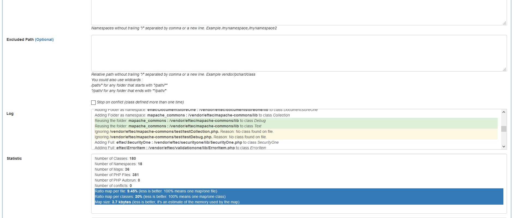

# PHP Auto Include AutoLoadOne Generator

AutoloadOne is a program that generates an autoload class (Auto Include) for PHP that is project specific. This class is useful to use classes on code without calling each "include" manually.   It is a direct alternative to Composer's autoload, but it works differently.   Composer's autoload, scans the folders during runtime, while this library only scans the folder once and it stores the result.

[](https://packagist.org/packages/eftec/autoloadone)
[](https://packagist.org/packages/eftec/autoloadone)
[]()
[]()
[]()
[]()
[]()


Contrary to other alternatives, it supports the easiest way to autoload classes using PHP without sacrifice performance.  How it works?. AutoLoadOne pre-calculates every class of a project and generates a single autoload.php (or the name indicated) file that it's ready to use.  You don't need a specific folder, structure or rule to use it. Just generate the autoload class, include and you are ready to load any class (even classes without a namespace, classes in the namespace in different folders, multiple classes defined in a single file...).  

AutoLoadOne is a replacement to Composer's Autoload, rendering obsolete the use of psr-0 or psr-4.  

**Last Update Octuber 14, 2018**

> "Universal Autoloading classes in PHP, any class, any time!"

## How it Works?

:one:  
 Run AutoLoadOne.php as CLI or as Web.  
:two:  
 AutoLoadOne will generate a single file called autoload.php (or the name indicated) based in your project. For the record, it takes mere 1.5 seconds to scan Wordpress and yes, it is compatible with Wordpress.  
:three:  
 Include the generated file (ex: autoload.php) in your project code and start using it.  

## When i should re-run AutoLoadOne?

You don't need to run it again if you are adding a new class with the same namespace in the same folder.

Also, you could edit autoload.php manually by adding more classes and namespaces.

Or you could run AutoLoadOne.php again and replace the old generated file.

## Composer Autoload features:
:black_square_button: One class per file  
:black_square_button: One Namespace per file.  
:black_square_button: The file must have a namespace.  
:black_square_button: It requires composer.  
:black_square_button: It validates the file each file the class is loaded per user.  
:black_square_button: The structure of the folders should be pre-defined.  
:white_check_mark: Support CLI  

## AutoLoadOne extended features:
:white_check_mark: One or Many classes per file.  
:white_check_mark: One or many namespaces per file.  
:white_check_mark: The file could contain optionally a namespace.  
:white_check_mark: It only requires PHP  
:white_check_mark: The folder structure and classes are validated once.  
:white_check_mark: If you add a class that shares a previous folder and uses the previous namespace, then you don't need to run the generator.  
:white_check_mark: You could use any structure of folder. It's recommended to use the same folder for the same namespace but it's not a requisite.  
:white_check_mark: Support CLI and Web-UI.  
:white_check_mark: It doesn't require APCU, lock files or cache.  
:white_check_mark: It´s compatible with practically any project, including a project that uses Composer's autoload.  
:white_check_mark: PSR-0, PSR-4, and practically  any specification, since you don't need to use any special configuration or standard.  
:white_check_mark: It allows libraries outside of the project folder.  For example /someuser/myproject/ allows to include libraries from the folder /otheruser/library/

## Usage (generate code via Web)

:one:  
 Copy the file **autoloadone.php** somewhere.

:two:  
 For security, you couldedit the first lines of the class **autoloadone.php**. Change the user, password and autoloadenter if it's required.

```php
<?php
define("_AUTOLOAD_USER","autoloadone");
define("_AUTOLOAD_PASSWORD","autoloadone");
define("_AUTOLOAD_ENTER",true); // if you want to autoload (no user or password) then set to true
?>
```
:three:  
   Start the browser

Enter your user and password.  If _AUTOLOAD_ENTER is true then you are logged automatically.


:four:  
 Select the folder to scan, then select the file to generate and finally press the button GENERATE.


* Root Folder : The folder to scan.
* Generated File: The full path (local) of the autoload.php.  Even if you are not using the generation of file, you must specify it, because the program uses for determine the relative path.
* Save File: If you check it, then generate file will be generated.  If PHP doesn't have access to save the file, then you could copy the code manually (screen Result)
* Excluded Namespace : Namespace excluded of mapping.
* Excluded Map : Paths excluded to scan (they are not recursives)


:five:  
 The result should looks this:


## Usage (via cli)


In the shell, browser to the folder where you want to generate the code and run the next command

Commands available :  

* current (scan and generates files from the current folder)  
* folder (folder to scan)  
* filegen (folder where autoload.php will be generate)
* filename (name of the filename to generate by default its autoload.php)  
* save yes/no (save the file to generate).This option is required.
* excludens (namespace excluded)  
* excludepath (path excluded)  
* externalpath (include an external path). An external path is a library that lives outside of the project folder


> Example: php autoloadone.php -folder folder\scan -filegen folder\whereautoload\ -save yes


```
php folder/located/autoloadone.php -current
```


## Usage of the generated file (autoload.php)

:one:  
include the generated file by the previous step. ex: autoload.php

```php
<?php
define("_AUTOLOAD_ONEDEBUG",true); // this line is optional. By default, the DEBUG is off. The debug mode is used for find errors.
include "autoload.php"; // it could be an absolute or relative path.
?>
```
and that's it!.

In the /test folder you could find some example to try.

> Note:Finally, you could delete the file autoloadone.php if you wish for.

## Note

> If you want to exclude a class, you could add the namespace to the exclude list, or you could skip a folder.  
> Also, if a class has the next comment, it's excluded automatically:

```php
<?php
// @noautoload
?>
```


## Autorun

> If you want to execute (run) a php file, then you could add the next comment.

```php
<?php
// @autorun
?>
```

> You could also set priority to the execution by adding a comment with @autorun first

```php
<?php
// @autorun first
?>
```


> If you find the error: Parse error: syntax error, <message> in on line 000. Then some of the php files scanned have some syntax error. The solution is to fix the problem or to exclude the whole folder.  
> How to find the file with error? You could run the page with the debug flag: autoloadone.php?debug=1  

## Extension

You could change the extension (by default it is .php) by running the next command

```php
$auto=new AutoLoadOne();
$auto->extension='.php'; // it's not required. By default it's .php
```

## Statistic and optimization

This library generates the next statistics.  **The objective is simple, you must reduce (in the possible), the size of the map. The smaller the map, then the better.**

```
Number of Classes: 42
Number of Namespaces: 12
Number of Maps: 16
Number of PHP Files: 50
Number of PHP Autorun: 3
Number of conflicts: 0
Ratio map per file: 32% Acceptable (less is better. 100% means one map/one file)<
Ratio map per classes: 38.1% Acceptable (less is better. 100% means one map/one class)
Map size: 3.1 kbytes (less is better, it's an estimate of the memory used by the map)
```
Example of the screen:



In the log file:
* White means a normal operation
* Yellow means a warning. For example, some file was excluded.
* Green means an optimization.
* Blue means an important operation was done succesfully.
* Red is an error that must be attended.


### How can I reduce the map?

* You could use one class / one file, also, the class must have the same name than the filename.  **The name of the namespace is irrelevant**
  > Example Customer.php and class Customer { }
* Grouping classes of the same namespace in the same folder. So, the library could maps the whole namespace as a single folder instead of map per file/class. 
* * :file_folder: repository (_repositoryns\\_)
* * * :page_with_curl: MyClass.php _repositoryns\\MyClass_
* * * :page_with_curl: MyClass2.php _repositoryns\\MyClass2_
* * :file_folder: model (_namespace_model\\_)
* * * :page_with_curl: MyClass.php _namespace_model\\MyClass_
* * * :page_with_curl: MyClass2.php _namespace_model\\MyClass2_
* You could remove (:scissors:) namespaces and folders that you don't need it. Some namespaces and folders are used by the system however, they don't require to be autoloaded because they are loaded manually (for example, most libraries load it's own include manually)
* * :file_folder: somelibrary 
* * * :page_with_curl: MainLibraryClass.php 
* * * :page_with_curl: IncludesLibrary.php :scissors:
* * * :file_folder: somelibrary :scissors:
* * * * :page_with_curl: MoreIncludesLibrary.php :scissors:
* * * * :page_with_curl: MoreIncludesLibrary.php :scissors:
* You could also exclude a file/class/include/strut by adding the tag **@noautoload**
```php
/* @noautoload */
class Someclass {

}
```
* * :file_folder: somelibrary 
* * * :page_with_curl: MainLibraryClass.php 
* * * :page_with_curl: IncludesLibrary.php **@noautoload** :scissors:
* Only files with the extension **.php** (or the defined extension) are loaded. So, Files **.inc**, **.phpinclude** or similar, are automatically excluded (:scissors:).
* * :file_folder: somelibrary 
* * * :page_with_curl: file.inc.php (inc.php is included but .inc)
* * * :page_with_curl: IncludesLibrary.inc :scissors:
* * * :page_with_curl: MoreIncludesLibrary.inc :scissors:
* Another optimization is to write **many classes in the same file**. This library even allows to use multi classes / multi namespaces in the same file. So, it's possible to create a bulk version of a project.
* * :page_with_curl: AllClassesOneFile.php 
* * * namespace _repositoryns\\_
* * * * class _repositoryns\\MyClass_
* * * * class _repositoryns\\MyClass3_
* * * namespace _anotherns\\MyClass2_
* * * * class _anotherns\\MyClass2_

## Test 

I created a empty blog on Laravel. The project is empty but the default libraries and components.


Files:

    7545 files in total. (including files that aren't PHP files)
    
### AutoLoadOne

    Number of Classes: 5565
    Number of Namespaces: 765
    Number of Maps: 2305 (you want to reduce it)
    Number of PHP Files: 6302
    Number of PHP Autorun: 0
    Number of conflicts: 31

File generated:   

    autoload.php 231kb.
    
### Optimized AutoLoadOne 

I separated PHPUnit and Mockery from the project. Why?. Both libraries are for unit test.

excluded namespace = /vendor/phpunit/*,/vendor/mockery/*


    Number of Classes: 5565
    Number of Namespaces: 765
    Number of Maps: 1535 (you want to reduce it)
    Number of PHP Files: 6302
    Number of PHP Autorun: 0
    Number of conflicts: 13     

File generated: 

    autoload.php 159kb.    

### Composer's autoload (using optimize)

composer dump-autoload -o

    Generated optimized autoload files containing 3519 classes
    Number of Maps: 3519 (static and not-static)

Autoload uses one of the next methods:

* Static:  (fast method, it uses more memory and it requires to be calculated manually)

  
    autoload.php 1kb  
    autoload_real.php 3kb  
    autoload_static.php 468kb  
    ClassLoader.php 14kb  


* Not static: (default method)


    autoload.php 1kb
    autoload_real.php 3kb
    autoload_namespaces.php 1kb
    autoload_psr4.php 4kb
    autoload_classmap.php 426kb    


### Why the size matter?.

Let's say we are calling a single webpage that uses autoload.

If we use **Composer's autoload (static)**, we are also calling a file that uses **468kb** (plus other files), and this memory is loaded into the memory. It could use (an average of) **609kb of ram** per call (it's around PHP file x 1.3 x 1kb)
 
For example, what if we have **1000 concurrent users**. It will use 609kb x 1000 = **609mb of ram** thanks to Autoload alone at the same time and with **10k concurrent users** we will use **6gb of ram** only because autoload.   


With **AutoLoadOne**, it is optimized to **302mb** (1000 users) or 3gb (10k users), it is for the version not optimized.

AutoLoadOne tags all classes from the project, including classes that aren't defined in composer.json (unless they are excluded from the project). **Composer's autoload found only 3519 classes, while AutoLoadOne found all classes of the project (5565).**

However, some classes are not required to be loaded by the project (for example unit test classes), so we could exclude those classes of the project.

For example, excluding PHPUnit and Mockery reduces the use to 206mb (1000 users) or 2gb (10k users) but **we could optimize it even further.**
 
| Concurrent Users | Composer's autoload (Optimized) | AutoLoadOne | AutoLoadOne Optimized |
|------------------|---------------------------------|-------------|-----------------------|
| 1000             | 609mb                           | 301mb       | 206mb                 |
| 10000            | 6gb                             | 3gb         | 2gb                   |


### Lookup usage?

Let's say we have a "map" with different elements. How much time does it takes to find the element of the map?.

|Map size|Time (1 million of lookup sequentially)|
|--------|----|
|100     |0.271 seconds +/- |
|10.000  |0.299 seconds  +/-  |
|1.000.000|0.376 seconds  +/- |

So, the size of the map/lookup time is not important. The difference between a small map (100 elements) versus a huge map (1 million of elements) is 0.1 second in total (per 1 millon of queries). However the memory usage matters and it could impact the performance considerably.

#### How many lookup are called?.

Let's say we have 10k concurrent users and each one calls 100 different classes. It means we are doing 10k x 100 = 1 million of lookup at the same time.

## TEST II (Magento 2.x)

Magento is a huge project, it has 22k PHP files and from it, 20k are classes.  However, it generates a map of 9.2k elements (without optimization)

AutoLoadOne:

    Number of Classes: 20596
    Number of Namespaces: 6868
    Number of Maps: 9242 (you want to reduce it)
    Number of PHP Files: 22227
    Number of PHP Autorun: 0
    Number of conflicts: 6

    File size 1.06mb

It takes 38 seconds to generate the autoload.php 

While using Composer's autoload (optimized)

    Generated optimized autoload files containing 11329 classes
    Number of Maps: 11329 (1.6mb file size)

| Concurrent Users(*) | Composer's autoload (Optimized) | AutoLoadOne (not optimized) |
|------------------|---------------------------------|-------------|
| 1000             | 2.08gb                          | 1.37gb      |
| 10000            | 20.8gb                          | 13.7gb      |    

> (*) However, Magento wasn't create for concurrency. But, however what we are measuring is not the number of concurrent users but the number of concurrent calls (for example rest-json, opening a page and such).

### Code execution.

Both AutoLoadOne and Composer's autoload execute a code when it is initialized/executed.

When AutoLoadOne generates the map, it consists of two relational arrays as follow:

```php
    private $_arrautoloadCustom = array(
		'Magento\AdminNotification' => '/app/code/',
		'Magento\Notice' => '/app/code/Developer/',...

```

While Composer's autoload generates an array that requires concatenation.

```php
array(
    'Magento\\AdminNotification' => $baseDir . '/app/code/MagentoActions.php',
    'Magento\\Notice' => $baseDir . '/app/code/Developer/Notice.php',
```

So it requires to concatenate each map (with a variable called $baseDir).  So Composer's autoload affects slighly the performance.


## Benchmark

PHP 7.1.18 + Windows 10 + SSD.

  

_More is better._


> I did a synthetic benchmark by loading different classes and reading the performance of it. Since my machine has a SSD disk then, the impact of the disk is minimum in comparison with a mechanical hard disk.
> This chart compares the performance against INCLUDE.

## Security

You could block the access to the file

RedirectMatch 403 ^/folder/^/folder/.*$

> :heavy_exclamation_mark: While the program has a build-in-security measure, however I suggest to protect adding new layers of security such as locating the AutoLoadOne.php file outside of the public/web folder.

> AutoLoadOne.php is not safe (because it writes a generate file), it doesn't have access to the database, neither it allows to write any content to the file but, it could overwrite an exist code and put down a system.

> However, the generate file is safe (autoload.php) and you could expose to the net.

* Change the user and password and set _AUTOLOAD_ENTER to false.
* Or, Don't put this file in your public website.
* Or, change the filename.
* Or, you could block the access to the file using .htaccess or similar.  

```
RewriteEngine On
RewriteBase /

<Files "AutoLoadOne.php">
Order Allow,Deny
Deny from all
</Files>
```

* Or you could restrict the access to PHP and it's the behaviour by default on Linux (it runs under Apache's account, most of the time as user NOBODY)

## Version
* 1.14 2019-06-08 Fixed some bug
* 1.12 2019-05-10 Added some changes pushed. Removed css.
* 1.11 2019-03-04 It allows to specify the result php file. And some cleanups.  Now, /namespace/nameclass:class is not considered a class
* 1.10 2018-10-18 It solves a small bug when we load autoload.php from a different url and it calls a external and remote folder.
* 1.9 2018-10-14 A small fix and some colors.
* 1.8 2018-10-14 Added external path and some fixes. Now you could add a path without comma (it's added automatically) [WebUI] 
* 1.7 2018-10-12 Some small fixes. Now by default, the system uses the caller's path instead of the AutoLoadOne.php path.
* 1.6 2018-09-28 Added wildcard (*) to exclusion list (folders).
* 1.5 2018-09-05 Now the interface open automatically by default. This file must be delete or restricted if it's used publicity.
* 1.4 2018-08-25 Some example. Now the interface doesn't open automatically by default. It's for security.
* 1.3 2018-07-05 Now it works with interface and it fixes a problem with some specific file.  It also fixes a problem with linux vs windows folder.
* 1.2 2018-07-01 Lots of changes. Modified exclusion.  Title and icons for the web ui.  It also allows to disable the web.
* 1.1 2018-06-26 Some fixes. 
* 1.0 2018-06-24 First version  

## Todo
* ~~Save configuration~~
* ~~CLI (more commands)~~
* Clean the code.
* ~~Convert to a single class.~~
* ~~External folder/library (relative or absolute path)~~
* The generation fails if a php file has an error.
* ~~Specify the extensions. By default it scans only .php files.~~